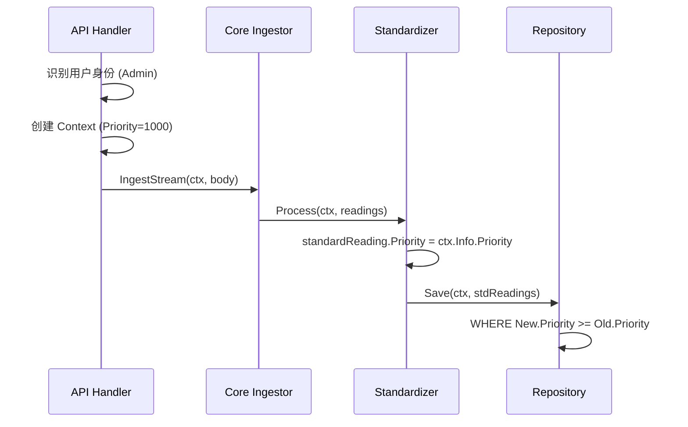

# 01. 数据接入与上下文 (Ingestion & Context) 开发手册 v2.0

## 1. 核心架构：Universal Ingestor

UniversalIngestor 是系统的唯一官方入口，它的主要职责是：
1.  **Format Adaptation**: 将 CSV/JSON/Binary 统一为 Go Struct。
2.  **Context Injection**: 为数据流注入“出身证明” (Priority, Operator)。

## 2. 代码实战：实现一个 JSON 流式 Ingestor

流式处理对于处理数百 MB 的上传文件至关重要。以下是 `json_ingestor` 的最佳实践代码：

```go
func (h *HexJSONIngestor) IngestStream(ctx context.Context, stream io.Reader) (*domain.IngestionResult, error) {
    decoder := json.NewDecoder(stream)
    
    // 自定义流解析循环
    // Tokenize -> Check '[' -> Loop
    if t, err := decoder.Token(); err != nil || t != json.Delim('[') {
       return nil, fmt.Errorf("expected JSON array start")
    }
    
    for decoder.More() {
       var reading domain.Reading
       if err := decoder.Decode(&reading); err != nil {
           // 处理单个解析错误，不要中断整个流
           result.FailedCount++
           continue
       }
       // 批处理逻辑...
    }
}
```

## 3. 核心大脑：IngestContext 全链路传递

### 3.1 为什么 Go Context 很重要？
在 Prism 中，`context.Context` 不仅仅用于超时取消，它是元数据的载体。
我们的 `Priority` 并不在 `Reading` 结构体里（因为那是客观数据），而是在 `Context` 里（因为这是操作属性）。

### 3.2 优先级传递图



### 3.3 如何正确构造 Context

```go
import "github.com/renjie/prism-core/pkg/core/domain"

func HandleUpload(w http.ResponseWriter, r *http.Request) {
    // 1. 提取基础 Context
    ctx := r.Context()
    
    // 2. 构造 IngestContext
    ingestInfo := domain.IngestContext{
        TraceID:  uuid.New().String(),
        Operator: r.Header.Get("X-User-ID"),
        BatchID:  fmt.Sprintf("BATCH-%d", time.Now().Unix()),
        // 关键决策点：决定这批数据的命运
        Strategy: determineStrategy(r), 
    }
    
    // 3. 注入 (Immutable wrapper)
    ctx = domain.NewContext(ctx, ingestInfo)
    
    // 4. 下传
    service.Process(ctx, file)
}

func determineStrategy(r *http.Request) domain.IngestStrategy {
    if r.URL.Query().Get("mode") == "calibration" {
        return domain.IngestStrategyCalibration // Priority 1000
    }
    return domain.IngestStrategyRealtime // Priority 100
}
```
