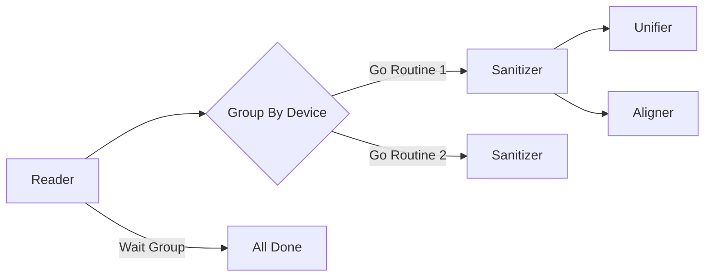

# 02. 数据标准化与核心服务 (Standardization Service) 开发手册 v2.0

## 1. 核心流程：Standardizer 是如何工作的？

Standardizer 是一个协调者。它本身不应该包含过多的 `if-else` 业务规则，而是负责将数据流经一系列的处理器。



## 2. 深入核心组件

### 2.1 Aligner (时间对齐算法)

Aligner 的目标是将离散的物理时间 T 映射到标准的逻辑时间 Grid。

**算法逻辑 (Nearest Neighbor with Tolerance):**

假设 Standard Interval = 15分钟。
Grid Points: 10:00, 10:15, 10:30。

*   **Case 1 (完美匹配)**: 读数时间 10:00:00 -> 映射到 10:00
*   **Case 2 (允许误差内)**: 读数时间 10:01:05 -> 映射到 10:00 (如果 Tolerance > 1min)
*   **Case 3 (冲突)**: 10:01 有读数A, 10:02 有读数B。
    *   Aligner 会选择由外部逻辑预处理后的结果，或者简单地取最近的一个。

### 2.2 Unifier (度量衡与精度)

为什么我们使用 `int64` 存储 `ValueScaled`？

```go
// 浮点数的坑
val := 0.1 + 0.2 // = 0.30000000000000004
```

在金融和高精度计量领域，浮点数是不可接受的。
我们使用 `ScaleFactor` (比如 10000):
*   存储值: 100.1234 -> `1001234`
*   计算: 所有的加减乘除都在 int64 域进行，速度快且精度绝对准确。
*   展示: 只在最后 UI 展示时除以 Factor。

## 3. 并发模型与性能优化

`ProcessAndStandardize` 内部实现了自动分片并发：

1.  **Sharding**: 根据 `DeviceID` 将大批量的 Readings 分组。
2.  **Concurrency Limit**: 使用 `Semaphore` (信号量) 模式控制并发度，防止大量 Goroutine 耗尽内存。

```go
// 信号量模式代码摘录
sem := make(chan struct{}, s.concurrencyLimit) 

for _, group := range deviceGroups {
    sem <- struct{}{} // 获取令牌
    go func() {
        defer func() { <-sem }() // 释放令牌
        processGroup(group)
    }()
}
```

## 4. 扩展开发常见问题

### Q1: 我想添加一个新的标准化步骤（比如单位换算 kW -> W）？
A: 不要硬编码在 `standardizeOne` 里。
1.  可以考虑在 `Sanitizer` 之前的 Pipeline 添加 `Converter`。
2.  或者在 `standardizeOne` 里调用一个新的 `UnitConverter` 接口。

### Q2: 为什么 `StandardReading` 结构体这么大？
A: 它是一个 "Rich Domain Model"。它不仅仅是 DTO，它包含了所有用于后续决策的元数据（如 Priority, Quality, SourceType）。它被设计为自包含的 (Self-contained)，不需要查询其他表就能理解这条数据。
