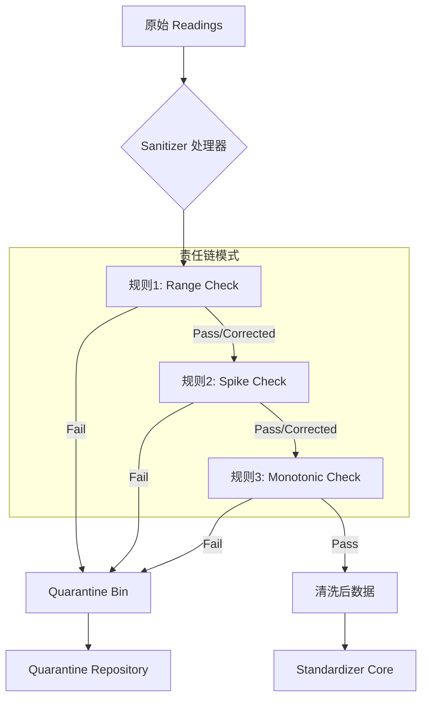

# 03. 数据清洗与治理 (Sanitizer & Governance) 开发手册 v2.0

## 1. 核心架构图

数据在进入 Standardizer 后，首先通过 Sanitizer 通道。只有“健康”的数据能继续前行，"生病"的数据会被送往隔离区。



## 2. 核心接口详解

### 2.1 Piped Processing (管道与过滤器)
我们的 `Sanitizer` 不是简单的过滤器，它支持**修改**数据。
*   入参：`readings []Reading`
*   出参 1：`clean []Reading` (可能比入参少，也可能值被修改过)
*   出参 2：`quarantined []QuarantineReading` (被剔除的数据)

### 2.2 规则接口定义
位于 `pkg/core/ports/filter.go`。

```go
type CleaningRule interface {
    // Check 检查并可能修正当前读数
    // prev: 上一个有效读数指针（用于状态性检查，如增量验证）
    // curr: 当前读数
    // 返回值:
    //   Reading: 修正后的读数 (仅当 ok=true 有效)
    //   bool:    是否通过 (true=Pass/Corrected, false=Reject)
    //   error:   拒绝原因 (仅当 ok=false 有效)
    Check(prev *domain.Reading, curr domain.Reading) (domain.Reading, bool, error)
}
```

## 3. 实战：开发一个“单调递增规则” (Monotonic Rule)

假设我们需要确保电表读数永远不会变小（除非发生 Rollover）。以下是完整的开发步骤：

### Step 1: 定义规则结构
在 `pkg/core/services/rules/monotonic_rule.go` 中：

```go
type MonotonicRule struct {
    Action domain.RuleAction // REJECT 或 CORRECT
}
```

### Step 2: 实现 Check 方法

```go
func (r *MonotonicRule) Check(prev *domain.Reading, curr domain.Reading) (domain.Reading, bool, error) {
    // 第一条数据无法判断趋势，默认通过
    if prev == nil {
        return curr, true, nil
    }
    
    // 如果当前值 < 上一次的值
    if curr.Value < prev.Value {
        // CASE A: 规则配置为 REJECT
        if r.Action == domain.ActionReject {
            return curr, false, fmt.Errorf("value regression detected: %.2f < %.2f", curr.Value, prev.Value)
        }
        
        // CASE B: 规则配置为 CORRECT (强制拉平)
        if r.Action == domain.ActionCorrect {
            fixed := curr
            fixed.Value = prev.Value // 简单的修正策略：保持上一刻的值
            fixed.Quality = domain.QualityCorrected
            return fixed, true, nil
        }
    }
    
    return curr, true, nil
}
```

### Step 3: 注册到工厂
在 `pkg/adapters/factory/rule_factory.go` 中注册，使其可以通过 JSON 配置动态加载。

```go
func init() {
    GetRuleFactory().Register(domain.RuleTypeMonotonic, func(params map[string]any, action domain.RuleAction) (ports.CleaningRule, error) {
        return &rules.MonotonicRule{Action: action}, nil
    })
}
```

## 4. 隔离区数据 (Quarantine Data)

当数据被规则拒绝时，它会以如下 JSON 结构存储在 `quarantine_readings` 表中：

```json
{
  "id": "uuid-gen-1",
  "device_id": "Device_A",
  "timestamp": "2023-01-01T10:00:00Z",
  "original_value": -50.2,
  "status": "PENDING",
  "reason": "value regression detected: -50.2 < 100.0",
  "rule_id": "rule_monotonic_01",
  "batch_id": "batch_import_202310"
}
```

### 治理流程
1.  **查询**: 调用 `QuarantineRepo.FindPending()` 拉取问题数据。
2.  **诊断**: 管理员查看 `reason` 和前后文。
3.  **决策**:
    *   **忽略 (Ignore)**: 确实是设备故障乱码，点击“忽略”。状态变为 `IGNORED`。
    *   **修正 (Fix & Re-inject)**: 管理员手动将值改为正确值，重新提交。
        *   这里会触发一个新的 Ingest 流程，**Context 中必须带上 `Priority=1000` (Calibration)**，以确保修正后的数据能覆盖掉可能的错误缓存。
