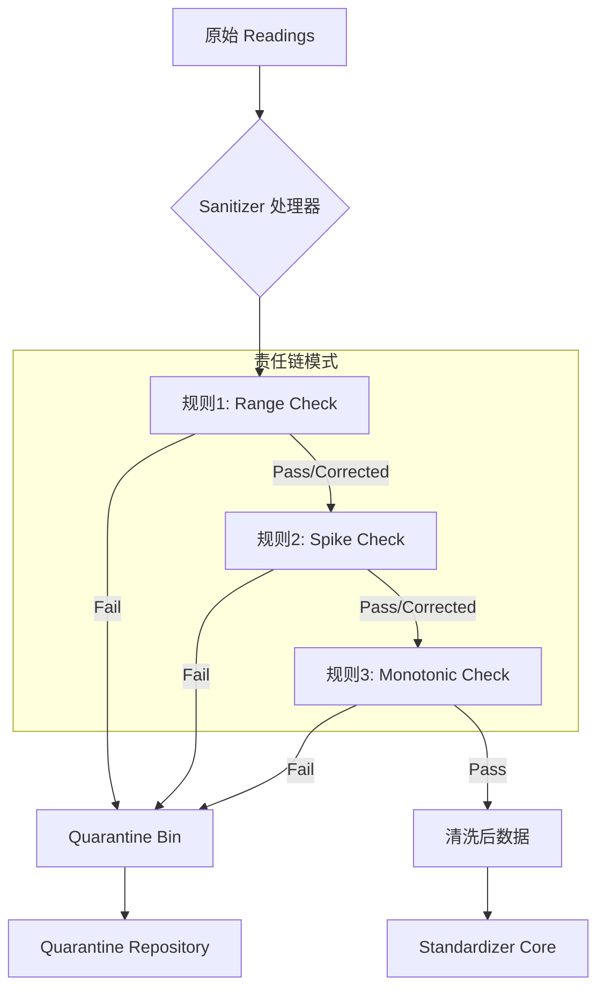

# 03. 数据清洗与治理 (Sanitizer & Governance) 开发手册 v2.0

## 1. 核心架构图

数据在进入 Standardizer 后，首先通过 Sanitizer 通道。只有“健康”的数据能继续前行，"生病"的数据会被送往隔离区。



## 2. 核心接口详解

### 2.1 Piped Processing (管道与过滤器)
我们的 `Sanitizer` 不是简单的过滤器，它支持**修改**数据。
*   入参：`readings []Reading`
*   出参 1：`clean []Reading` (可能比入参少，也可能值被修改过，**已按时间戳升序排列**)
*   出参 2：`quarantined []QuarantineReading` (被剔除的数据)

### 2.2 规则接口定义 (v2.0 新接口)
位于 `pkg/core/ports/filter.go`。

```go
// CleaningContext 清洗规则执行时的上下文信息
type CleaningContext struct {
    Previous *domain.Reading // 前一条读数 (可能为nil，表示第一条数据)
    // 可扩展其他上下文字段，如批次信息、设备元数据等
}

// CheckResult 清洗规则检查的结果
type CheckResult struct {
    Reading   domain.Reading // 结果读数 (可能是原值或修正后的值)
    Passed    bool           // 是否通过检查
    Corrected bool           // 是否进行了修正
    Reason    string         // 失败或修正的原因描述
}

type CleaningRule interface {
    // Check 检查当前读数是否满足规则
    // 返回 CheckResult 包含完整的检查结果信息
    Check(ctx CleaningContext, curr domain.Reading) CheckResult
}
```

**v2.0 接口改进说明:**
- 使用 `CleaningContext` 结构体替代 `*Reading` 指针，便于扩展上下文信息
- 使用 `CheckResult` 结构体替代多返回值，提供更丰富的结果信息
- 新增 `Corrected` 字段，明确标识数据是否被修正过

## 3. 实战：开发一个“单调递增规则” (Monotonic Rule)

假设我们需要确保电表读数永远不会变小（除非发生 Rollover）。以下是完整的开发步骤：

### Step 1: 定义规则结构
在 `pkg/core/services/rules/monotonic_rule.go` 中：

```go
type MonotonicRule struct {
    Action domain.RuleAction // REJECT 或 CORRECT
}
```

### Step 2: 实现 Check 方法 (使用新接口)

```go
func (r *MonotonicRule) Check(ctx ports.CleaningContext, curr domain.Reading) ports.CheckResult {
    // 第一条数据无法判断趋势，默认通过
    if ctx.Previous == nil {
        return ports.CheckResult{
            Reading:   curr,
            Passed:    true,
            Corrected: false,
        }
    }
    
    // 如果当前值 < 上一次的值
    if curr.Value < ctx.Previous.Value {
        // CASE A: 规则配置为 REJECT
        if r.Action == domain.ActionReject {
            return ports.CheckResult{
                Reading:   curr,
                Passed:    false,
                Corrected: false,
                Reason:    fmt.Sprintf("value regression detected: %.2f < %.2f", curr.Value, ctx.Previous.Value),
            }
        }
        
        // CASE B: 规则配置为 CORRECT (强制拉平)
        if r.Action == domain.ActionCorrect {
            fixed := curr
            fixed.Value = ctx.Previous.Value // 简单的修正策略：保持上一刻的值
            return ports.CheckResult{
                Reading:   fixed,
                Passed:    true,
                Corrected: true,
                Reason:    fmt.Sprintf("value corrected from %.2f to %.2f", curr.Value, ctx.Previous.Value),
            }
        }
    }
    
    return ports.CheckResult{
        Reading:   curr,
        Passed:    true,
        Corrected: false,
    }
}
```

### Step 3: 注册到工厂
在 `pkg/adapters/factory/rule_factory.go` 中注册，使其可以通过 JSON 配置动态加载。

```go
// 方式1: 使用单例 (生产环境)
GetRuleFactory().Register(domain.RuleTypeMonotonic, func(params map[string]any, action domain.RuleAction) (ports.CleaningRule, error) {
    return &rules.MonotonicRule{Action: action}, nil
})

// 方式2: 使用独立实例 (测试环境，提高可测试性)
factory := NewRuleFactory() // 创建独立实例
factory.Register(domain.RuleTypeMonotonic, builder)
```

## 4. 隔离区数据 (Quarantine Data)

当数据被规则拒绝时，它会以如下 JSON 结构存储在 `quarantine_readings` 表中：

```json
{
  "id": "uuid-gen-1",
  "device_id": "Device_A",
  "timestamp": "2023-01-01T10:00:00Z",
  "original_value": -50.2,
  "status": "PENDING",
  "reason": "value regression detected: -50.2 < 100.0",
  "rule_id": "rule_monotonic_01",
  "batch_id": "batch_import_202310"
}
```

### 治理流程
1.  **查询**: 调用 `QuarantineRepo.FindPending()` 拉取问题数据。
2.  **诊断**: 管理员查看 `reason` 和前后文。
3.  **决策**:
    *   **忽略 (Ignore)**: 确实是设备故障乱码，点击“忽略”。状态变为 `IGNORED`。
    *   **修正 (Fix & Re-inject)**: 管理员手动将值改为正确值，重新提交。
        *   这里会触发一个新的 Ingest 流程，**Context 中必须带上 `Priority=1000` (Calibration)**，以确保修正后的数据能覆盖掉可能的错误缓存。
